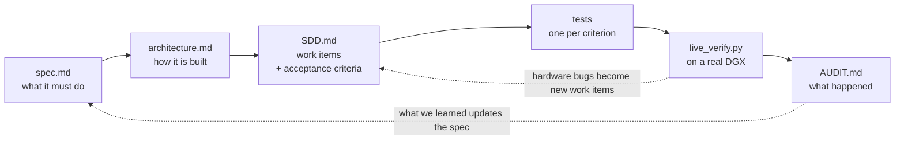

<div align="center">

# DGX Control

[](https://github.com/mayankgrd/dgx-control/actions/workflows/ci.yml)


[](LICENSE)

</div>

DGX Control is a self-hosted dashboard and control panel for the NVIDIA DGX Spark. It runs on the
DGX itself and serves the whole thing — UI and API — from a single port, so instead of opening an
SSH session and piecing the picture together from `nvidia-smi`, `docker ps`, `df` and `ss`, you get
it in a browser: GPU utilisation attributed to the process **and the container** holding it, the
unified memory pool reported as the single shared pool it actually is, Docker containers and images
with live CPU, memory and I/O, disk usage including the HuggingFace cache, every model already
downloaded to the box, every service currently running with the exact URL or SSH tunnel needed to
reach it from wherever you happen to be sitting, and an audit of which ports on the machine are
reachable from outside it.

It also handles the small operational jobs you would otherwise open a terminal for: start, stop and
restart containers, tail their logs, launch JupyterLab with direct GPU access or a vLLM server from
a vetted catalog, and stop a runaway process. Installation is one unprivileged script — no `sudo`
at any point — every request requires a token, control actions are off until you turn them on, and
it can register itself into NVIDIA Sync so it opens from there alongside the built-in tools.


## Install

```bash
git clone https://github.com/mayankgrd/dgx-control ~/dgx-control
cd ~/dgx-control
./deploy/install.sh
```

It installs into a virtualenv under `~/.local/share/dgxctl`, builds the UI, then asks a handful of
questions — who should be able to reach it, whether control actions are allowed, whether to add it
to NVIDIA Sync. **No `sudo` at any point.**

It adapts to the machine: no Tailscale means no tailnet options, no Docker means the container
pages report themselves unavailable rather than failing. Re-run `dgxctl onboard` any time; it
preserves everything it does not manage.

Then open the URL it prints and paste the token from `dgxctl token --show`.

<details>
<summary><b>Unattended / fleet install</b></summary>

```bash
./deploy/install.sh --yes --bind loopback --no-control --no-sync
```

Every question has a flag: `--bind loopback|tailnet-serve|all|tailnet-address`, `--port`,
`--node-name`, `--control/--no-control`, `--sync/--no-sync`, `--service/--no-service`.
`--no-onboard` installs without asking anything.
</details>

<details>
<summary><b>Requirements & uninstall</b></summary>

Python 3.11+, Linux, aarch64 or x86_64. Node 20+ if you want the dashboard as well as the API.
Everything else is optional and degrades gracefully — `dgxctl doctor` reports what your machine
offers.

```bash
./deploy/uninstall.sh              # keeps your config and history
./deploy/uninstall.sh --purge      # removes those too
./deploy/uninstall.sh --dry-run    # show what would go, change nothing
```
</details>

## What it does

### Which container is holding the GPU

`nvidia-smi` tells you the GPU is busy; it does not tell you what is making it busy.
NVML reports host-namespace PIDs, and the GPU process is usually a *child* of the container's main
process — so the mapping is not obvious. dgxctl resolves it through `/proc/<gpu_pid>/cgroup` and
shows you the container by name.

On GB10 there is no separate GPU memory pool: `nvmlDeviceGetMemoryInfo` returns `NotSupported`.
Totals come from `/proc/meminfo` and render as **one segmented pool**, because two bars would imply
two budgets that do not exist.


### How to actually reach your services

The page answers *"how do I open this"* so you do not have to go and look. Services are grouped and
each says what it is — model servers, notebooks, agents, tools. Infrastructure and anything
unrecognised is collapsed behind one toggle (on a real box that hides SSH, DNS, Tailscale's own
listeners and eight ZMQ ports belonging to a single notebook kernel).

The access block is correct for **where you are**. A loopback-only service viewed from your laptop
gets the exact `ssh -N -L` command, naming an address you can actually reach. A service on
`0.0.0.0` gets a direct link at the DGX's real address. Model servers show the OpenAI base URL and
model name; Jupyter's token is read from its runtime file and folded into a working link, masked
until you reveal it.


### Every model on the box

HuggingFace cache, Ollama, and loose weights under any scan root — with size, context length,
architecture, quantisation, and which ones are currently being served.


### Containers, with honest exposure

Per-container CPU, memory and I/O, plus port bindings that distinguish a loopback publish from one
on all interfaces. (`HostIp: ""` in Docker means `0.0.0.0`, not "unknown" — reading it as loopback
would invert the whole safety signal.) Start, stop, restart, tail logs, or launch from a curated
catalog.


### And the rest

- **Exposure audit** — every non-loopback bind is a finding, with the owning process named. No
  other DGX dashboard does this.
- **Storage** — filesystems, the HuggingFace cache, Docker's reclaimable space.
- **Launchables** — JupyterLab from a host virtualenv (the way NVIDIA Sync's own dashboard runs it,
  because that is what gives a notebook direct GPU access), and vLLM from a pinned, known-good
  image. An instance already running is adopted, not duplicated.
- **Unified-memory budget guard** — refuses a launch when the summed `--gpu-memory-utilization`
  across running servers would exceed 0.70.
- **Multiple DGX systems** — one instance can aggregate peers behind a node switcher.
- **NVIDIA Sync** — `dgxctl sync register` adds it to Sync's own custom tools, preserving
  entries it did not create and backing the file up first.

<details>
<summary><b>Registering with NVIDIA Sync by hand</b></summary>

`dgxctl sync register` does this for you. If you prefer Sync's **Add Custom** dialog
([screenshot](docs/nvidia-sync-add-custom.png)):

| Field | Value |
|---|---|
| **Name** | `DGX Control` |
| **Port** | `8770` |
| **Auto open in browser at the following path** | checked |
| **URL Path** | `/` |
| **Launch Script** | `bash ~/dgx-control/deploy/nvidia-sync-launch.sh` |
| **Launch in Terminal** | unchecked (runs in the background) |

Sync opens `localhost:<port>`, so the service must be bound somewhere loopback can reach —
`127.0.0.1` or `0.0.0.0`, not a tailnet address alone. The launch script is idempotent: if the
service is already listening it exits cleanly without starting a duplicate.
</details>

## Everyday commands

```bash
dgxctl doctor     # what works on this machine, and how to fix what doesn't
dgxctl expose     # who can reach this, and the exact command to change it
dgxctl token      # --show, --rotate
dgxctl onboard    # re-run setup
dgxctl sync       # register | list | unregister with NVIDIA Sync
```

## Security posture

A Tailscale network can include machines belonging to other people, and a local network almost
certainly does. So:

- every route requires a bearer token (`GET /api/health` returns liveness only, no host data);
- startup **fails closed** — a non-loopback bind with no token refuses to start;
- control actions are gated separately and default to **off**;
- launched containers publish to loopback unless a catalog entry explicitly opts out;
- the dashboard reports **itself** as a finding when bound beyond loopback.

The token lives at `~/.config/dgxctl/token`, mode `0600`; a looser mode is refused.

### Choosing how to expose it

`dgxctl` binds **one** address. `dgxctl onboard` walks you through this; `dgxctl expose` shows the
current state and how to change it.

| | Config | Reaches | Notes |
|---|---|---|---|
| **Loopback** | `host = "127.0.0.1"` | this host only | Safest. NVIDIA Sync works. Remote access via `ssh -N -L 8770:127.0.0.1:8770 <host>`. |
| **Tailnet via `tailscale serve`** | `host = "127.0.0.1"` + `tailscale serve --bg 8770` | tailnet + loopback | Tightest remote option: tailnet only, **not** the LAN, with TLS. Needs one root command first: `sudo tailscale set --operator=$USER`. |
| **All interfaces** | `host = "0.0.0.0"` | tailnet **and LAN** | No root needed, loopback still works. Broader than a tailnet. |
| Tailnet address only | `host = "100.x.y.z"` | tailnet only | No root — but **breaks NVIDIA Sync**, which opens `localhost`. |

To require a specific Tailscale identity in addition to the token:

```toml
tailscale_allowlist = ["you@example.com", "teammate@example.com"]
```

If you reach the machine by name rather than a raw address, links and forward commands can say so:

```toml
advertise_addresses = ["dgx.lab.internal"]
```

## Configuration

Everything lives in `~/.config/dgxctl/config.toml`; see [config.example.toml](config.example.toml)
for the annotated set — declared services, peer DGX systems, scan roots, collector intervals.

## How this project is built

This project uses **spec-driven development**, with real hardware in the loop.

Every change starts as a numbered requirement and ends as a test that proves it. Nothing is added
just because it seemed like a good idea. The steps are always the same:

1. **Write the requirement** in `docs/spec.md`. It gets a number, like `R6.2`.
2. **Record how it will be built** in `docs/architecture.md`, if it needs a design decision.
3. **Open a work item** in `docs/SDD.md`. It gets a permanent id, like `SDD-015`, and lists the
   acceptance criteria as the names of the tests that will prove it.
4. **Write those tests, then the code.** Parsers are tested against real output captured from a
   DGX, never against made-up strings.
5. **Check it on a real machine** with `scripts/live_verify.py`, which runs 32 checks against a
   live DGX and compares what the dashboard reports with what the machine itself says.
6. **Write down what happened** in `docs/AUDIT.md`, including the things that turned out to be
   wrong.



**Hardware testing is not optional here, and it earns its place.** The test suite cannot see driver
quirks, real cgroup layouts, or a socket that is genuinely exposed to the network. Running on an
actual DGX found **eleven bugs that all 361 tests missed**, including a GPU memory call that simply
does not work on this chip and a systemd setting that silently broke the exposure audit. Each one
became a new work item with its own regression test.

### The workflow is written down in CLAUDE.md

[`CLAUDE.md`](CLAUDE.md) is the working agreement for this repo. It says which documents are the
source of truth, what to read before changing anything, that every acceptance criterion needs a
named test, that the audit gets written before the session ends, and which facts about DGX Spark
hardware change the design. Anyone can pick it up and follow the same loop — and because it is
plain markdown at the repo root, so can a coding agent.

### Want it to do something different? Edit the spec

The spec is the front door, not internal paperwork. If dgxctl does not show you something you need,
**you do not have to start in the code**:

1. Open [`docs/spec.md`](docs/spec.md) and write down what it should do, as a numbered requirement.
2. Add a work item to [`docs/SDD.md`](docs/SDD.md) with the tests that would prove it.
3. Implement it, run `uv run pytest -q`, and check it on your own DGX with
   `python3 scripts/live_verify.py`.
4. Add a note to [`docs/AUDIT.md`](docs/AUDIT.md) and open a pull request citing the id.

Steps 2 to 4 are mechanical once step 1 is clear, and a coding agent handed `CLAUDE.md` will do
most of it. A pull request that only adds a well-written requirement to `spec.md` is a genuinely
useful contribution — it is the part that needs a human who knows what their machine should be
telling them.

<details>
<summary><b>A worked example: one requirement, end to end</b></summary>

| Stage | Artefact |
|---|---|
| Requirement | **R1.5** — *"Present unified memory honestly: the pool is shared by CPU and GPU. Show the single pool with its breakdown, never as two independent budgets."* |
| Architecture | §4 says the NVML reading must be cross-checked against `psutil`; §11 lists "unified memory ↔ two-pool assumption" as a **seam** |
| Work item | **SDD-010**, acceptance criterion 2: *"`test_unified_memory_single_pool` — reported total ≤ physical total; GPU and system memory are never summed"* |
| Test | `test_reported_memory_never_exceeds_physical`, against a `/proc/meminfo` fixture captured from a real GB10 |
| Live check | `live_verify.py` step 3 compares the reported total against the machine's own `/proc/meminfo` |
| What happened | On hardware, `nvmlDeviceGetMemoryInfo` raised `NotSupported`. There is no separate GPU pool at all. Filed as **SDD-090**, fixed by reading `/proc/meminfo` and recording which source was used, and the UI now draws one segmented bar |
| Recorded | The 2026-08-31 entry in `AUDIT.md`, under the live-hardware regressions |

</details>

## Documentation

| Doc | What it is |
|---|---|
| [docs/spec.md](docs/spec.md) | Product requirements — R1–R16, S1–S9, N1–N8 |
| [docs/spec_frontend.md](docs/spec_frontend.md) | UI requirements — FE-C1–C11, FE-1–FE-10 |
| [docs/architecture.md](docs/architecture.md) | Architecture; §-indexed, load what you need |
| [docs/SDD.md](docs/SDD.md) | 48 numbered work items with acceptance criteria, and the live-hardware regression table |
| [docs/AUDIT.md](docs/AUDIT.md) | Session-by-session log, including every wrong turn |
| [docs/prior_art.md](docs/prior_art.md) | What already exists, and why this was built rather than adopted |
| [CLAUDE.md](CLAUDE.md) | The working agreement: the loop above, plus this hardware's specifics |

## Development

```bash
uv venv && uv pip install -e ".[dev]"
uv run pytest -q
uv run ruff check . && uv run ruff format --check .
cd web && npm ci && npm test && npm run typecheck && npm run build
```

Verify against real hardware — the suite cannot see driver quirks, real cgroup layouts, or a
genuinely exposed socket:

```bash
python3 scripts/live_verify.py   # run ON the DGX
```

Branches: `develop` for all work, `main` for deployment (fast-forward promotion).

## Licence

MIT — see [LICENSE](LICENSE).
