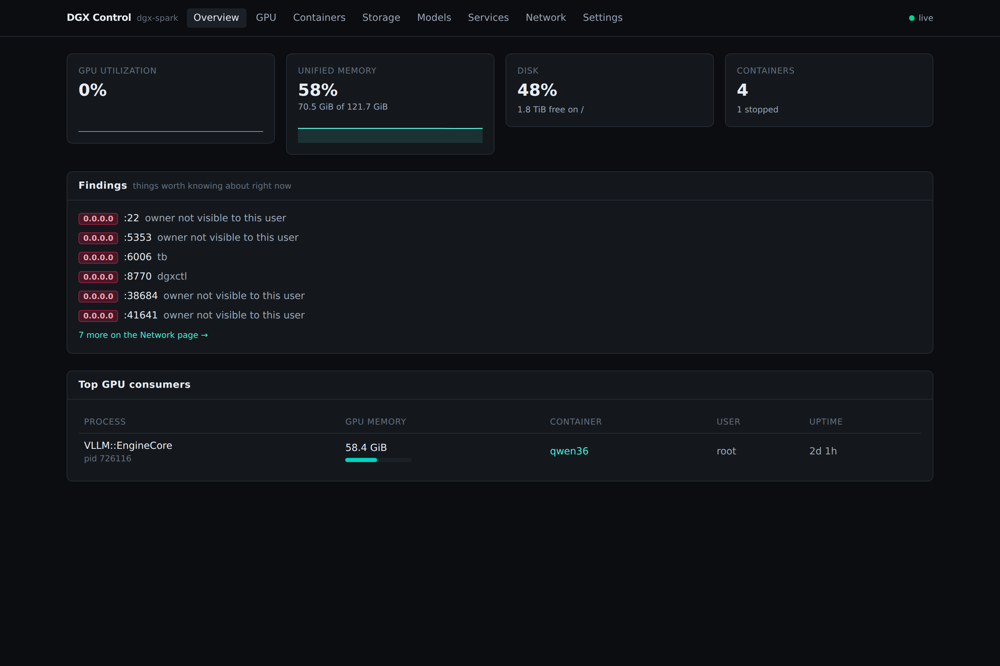
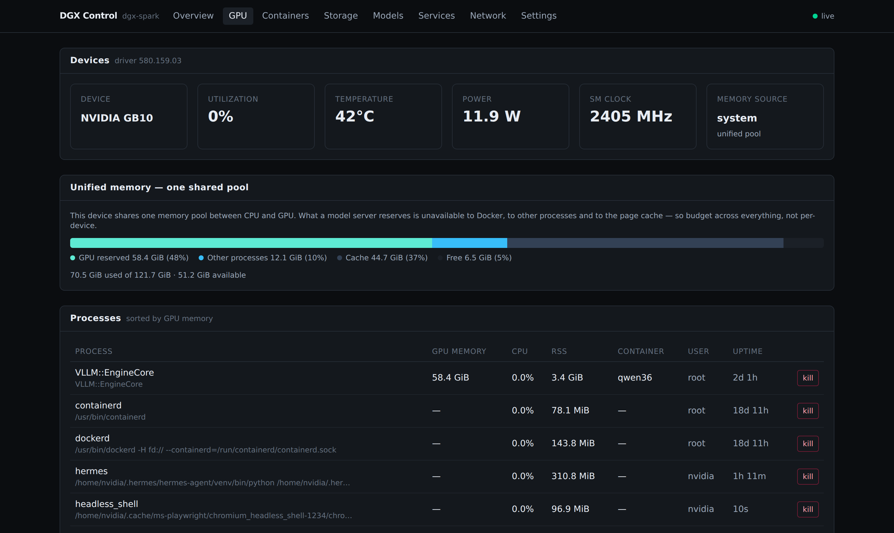
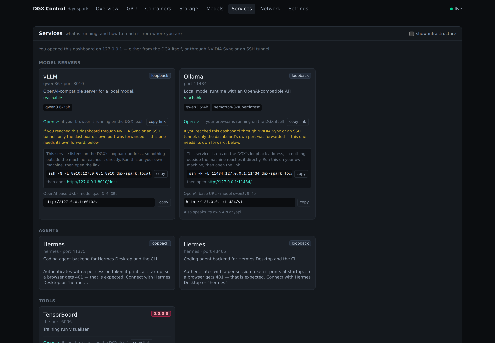
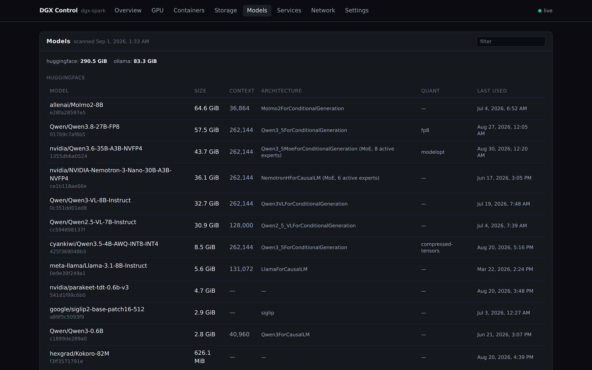
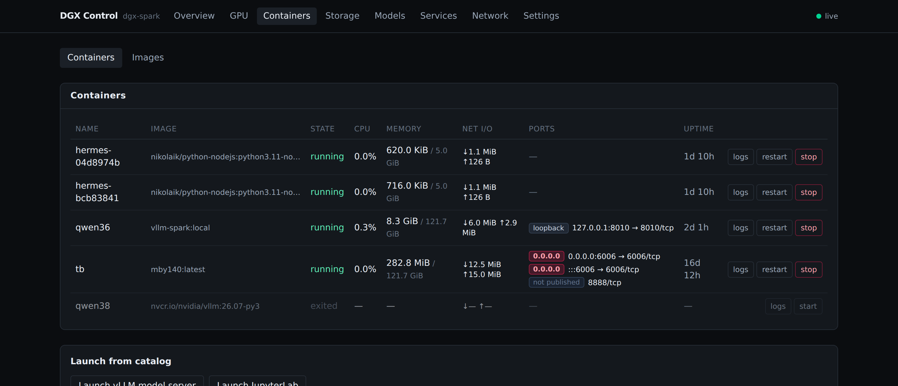

<div align="center">

# DGX Control

[](https://github.com/mayankgrd/dgx-control/actions/workflows/ci.yml)


[](LICENSE)

</div>

A dashboard and control panel for the NVIDIA DGX Spark. It runs on the DGX and serves the UI and
API from one port.

Open it in a browser instead of SSHing in to assemble the picture from `nvidia-smi`, `docker ps`,
`df` and `ss`. It shows what the GPU is doing and which container is doing it, what is running and
how to connect to it, which models are on the box, and which ports are reachable from outside. It
also starts and stops containers, launches JupyterLab or a model server, and stops a runaway
process.



## Install

```bash
git clone https://github.com/mayankgrd/dgx-control ~/dgx-control
cd ~/dgx-control
./deploy/install.sh
```

The installer asks three things: who should be able to reach it, whether control actions are
allowed, and whether to add it to NVIDIA Sync. **No `sudo` at any point.** Re-run `dgxctl onboard`
to change an answer.

It adapts to the machine. No Tailscale means no tailnet options. No Docker means the container
pages say so rather than failing.

Needs Python 3.11+ on Linux, and Node 20+ for the dashboard. `dgxctl doctor` reports what your
machine supports.

<details>
<summary>Unattended install, and uninstall</summary>

```bash
./deploy/install.sh --yes --bind loopback --no-control --no-sync
```

Every question has a flag: `--bind loopback|tailnet-serve|all|tailnet-address`, `--port`,
`--node-name`, `--control/--no-control`, `--sync/--no-sync`, `--service/--no-service`.
`--no-onboard` installs without asking.

```bash
./deploy/uninstall.sh              # keeps config and history
./deploy/uninstall.sh --purge      # removes those too
./deploy/uninstall.sh --dry-run    # show what would go
```
</details>

## What it does

### Finds which container is holding the GPU

`nvidia-smi` tells you the GPU is busy, not what is making it busy. The GPU process is usually a
child of the container's main process, so the mapping is not obvious. dgxctl resolves it through
cgroups and names the container.

Unified memory is shown as the one shared pool it actually is. On GB10 there is no separate GPU
pool — the NVML call returns `NotSupported` — so totals come from `/proc/meminfo`.



### Tells you how to reach everything that is running

Services are grouped and each says what it is. Infrastructure and unrecognised ports are hidden
behind one toggle.

The access details are correct for where you are. A loopback-only service viewed from your laptop
gets the exact `ssh -N -L` command. A service on `0.0.0.0` gets a direct link at the DGX's real
address. Model servers show their OpenAI base URL and model name. Jupyter's token is read from its
runtime file and folded into a working link, masked until you reveal it.



### Lists every model on the box

HuggingFace cache, Ollama, and loose weights under any scan root — with size, context length,
architecture, quantisation, and which are currently being served.



### Shows containers and what they expose

Per-container CPU, memory and I/O. Port bindings distinguish a loopback publish from one on all
interfaces. Start, stop, restart, tail logs, or launch from a catalog.



### And

- **Exposure audit** — every port bound beyond loopback is a finding, with its owner named.
- **Storage** — filesystems, the HuggingFace cache, Docker's reclaimable space.
- **Launching** — JupyterLab from a host virtualenv, so notebooks get direct GPU access, or vLLM
  from a pinned image. An instance already running is adopted, not duplicated. A launch is refused
  if the summed `--gpu-memory-utilization` would exceed 0.70.
- **Several DGX systems** in one tab, behind a node switcher.
- **NVIDIA Sync** — `dgxctl sync register` adds it to Sync's own tools.

## Commands

```bash
dgxctl doctor     # what works on this machine, and how to fix what doesn't
dgxctl expose     # who can reach this, and how to change it
dgxctl token      # --show, --rotate
dgxctl onboard    # re-run setup
dgxctl sync       # register | list | unregister with NVIDIA Sync
```

## Security

Every route needs a bearer token. `GET /api/health` returns liveness only. Startup fails closed: a
non-loopback bind with no token refuses to start. Control actions are gated separately and default
to off. Launched containers publish to loopback unless a catalog entry opts out. The dashboard
reports itself as a finding when bound beyond loopback.

The token lives at `~/.config/dgxctl/token`, mode `0600`. A looser mode is refused.

### Choosing how to expose it

dgxctl binds one address. `dgxctl expose` shows the current setting and how to change it.

| | Config | Reaches | Notes |
|---|---|---|---|
| **Loopback** | `host = "127.0.0.1"` | this host only | Safest. NVIDIA Sync works. Remote access via `ssh -N -L 8770:127.0.0.1:8770 <host>`. |
| **Tailnet, over TLS** | `host = "127.0.0.1"` + `tailscale serve --bg 8770` | tailnet + loopback | Tightest remote option. Not the LAN. Needs `sudo tailscale set --operator=$USER` once. |
| **All interfaces** | `host = "0.0.0.0"` | tailnet **and LAN** | No root needed, loopback still works. Broader than a tailnet. |
| Tailnet address only | `host = "100.x.y.z"` | tailnet only | No root, but **breaks NVIDIA Sync**, which opens `localhost`. |

A local network, and often a tailnet, includes machines you do not control. Choose deliberately.

Optional extras: `tailscale_allowlist = ["you@example.com"]` requires a named Tailscale identity in
addition to the token. `advertise_addresses = ["dgx.lab.internal"]` makes links and forward commands
use a name you actually reach the machine by.

## Configuration

Everything lives in `~/.config/dgxctl/config.toml`. See [config.example.toml](config.example.toml)
for the annotated set: declared services, peer DGX systems, scan roots, collector intervals.

<details>
<summary>Registering with NVIDIA Sync by hand</summary>

`dgxctl sync register` does this for you. If you prefer Sync's **Add Custom** dialog
([screenshot](docs/nvidia-sync-add-custom.png)):

| Field | Value |
|---|---|
| **Name** | `DGX Control` |
| **Port** | `8770` |
| **Auto open in browser at the following path** | checked |
| **URL Path** | `/` |
| **Launch Script** | `bash ~/dgx-control/deploy/nvidia-sync-launch.sh` |
| **Launch in Terminal** | unchecked |

Sync opens `localhost:<port>`, so the service must be bound where loopback can reach it —
`127.0.0.1` or `0.0.0.0`, not a tailnet address alone. The launch script is idempotent.
</details>

## Contributing

This project is built spec-first: a numbered requirement, a work item naming the tests that prove
it, then the code, then a check on real hardware. See
[docs/methodology.md](docs/methodology.md).

If dgxctl does not show you something you need, you do not have to start in the code. Write it down
as a numbered requirement in [docs/spec.md](docs/spec.md) and open a pull request. That is the part
that needs someone who knows what their own machine should be telling them.

## Documentation

| Doc | What it is |
|---|---|
| [docs/methodology.md](docs/methodology.md) | How this project is built, and how to contribute |
| [docs/spec.md](docs/spec.md) | Product requirements |
| [docs/architecture.md](docs/architecture.md) | Architecture, §-indexed |
| [docs/SDD.md](docs/SDD.md) | Numbered work items with acceptance criteria |
| [docs/AUDIT.md](docs/AUDIT.md) | Session log, including every wrong turn |
| [docs/prior_art.md](docs/prior_art.md) | What already exists, and why this was built |
| [CLAUDE.md](CLAUDE.md) | The working agreement for this repo |

## Development

```bash
uv venv && uv pip install -e ".[dev]"
uv run pytest -q
uv run ruff check . && uv run ruff format --check .
cd web && npm ci && npm test && npm run typecheck && npm run build
```

The suite cannot see driver quirks, real cgroup layouts, or a genuinely exposed socket. Verify on
hardware:

```bash
python3 scripts/live_verify.py   # run ON the DGX
```

Branches: `develop` for work, `main` for deployment.

## Licence

Apache License 2.0 — see [LICENSE](LICENSE) and [NOTICE](NOTICE).

Apache 2.0 rather than MIT for its explicit patent grant, which corporate legal review
generally prefers, and because contributions arrive under the same terms without a separate CLA.
