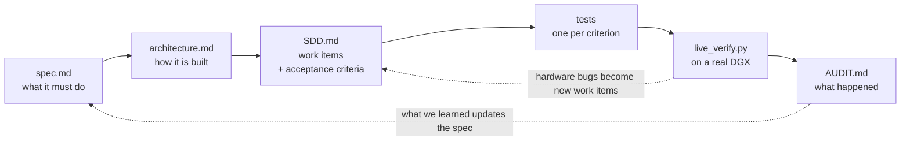

# How this project is built

This project uses **spec-driven development**, with real hardware in the loop.

Every change starts as a numbered requirement and ends as a test that proves it. Nothing is added
just because it seemed like a good idea. The steps are always the same:

1. **Write the requirement** in `docs/spec.md`. It gets a number, like `R6.2`.
2. **Record how it will be built** in `docs/architecture.md`, if it needs a design decision.
3. **Open a work item** in `docs/SDD.md`. It gets a permanent id, like `SDD-015`, and lists the
   acceptance criteria as the names of the tests that will prove it.
4. **Write those tests, then the code.** Parsers are tested against real output captured from a
   DGX, never against made-up strings.
5. **Check it on a real machine** with `scripts/live_verify.py`, which runs 32 checks against a
   live DGX and compares what the dashboard reports with what the machine itself says.
6. **Write down what happened** in `docs/AUDIT.md`, including the things that turned out to be
   wrong.

**Hardware testing is not optional here, and it earns its place.** The test suite cannot see driver
quirks, real cgroup layouts, or a socket that is genuinely exposed to the network. Running on an
actual DGX found **eleven bugs that all 361 tests missed**, including a GPU memory call that simply
does not work on this chip and a systemd setting that silently broke the exposure audit. Each one
became a new work item with its own regression test.

### The workflow is written down in CLAUDE.md

[`CLAUDE.md`](../CLAUDE.md) is the working agreement for this repo. It says which documents are the
source of truth, what to read before changing anything, that every acceptance criterion needs a
named test, that the audit gets written before the session ends, and which facts about DGX Spark
hardware change the design. Anyone can pick it up and follow the same loop — and because it is
plain markdown at the repo root, so can a coding agent.

### Want it to do something different? Edit the spec

The spec is the front door, not internal paperwork. If dgxctl does not show you something you need,
**you do not have to start in the code**:

1. Open [`docs/spec.md`](spec.md) and write down what it should do, as a numbered requirement.
2. Add a work item to [`docs/SDD.md`](SDD.md) with the tests that would prove it.
3. Implement it, run `uv run pytest -q`, and check it on your own DGX with
   `python3 scripts/live_verify.py`.
4. Add a note to [`docs/AUDIT.md`](AUDIT.md) and open a pull request citing the id.

Steps 2 to 4 are mechanical once step 1 is clear, and a coding agent handed `CLAUDE.md` will do
most of it. A pull request that only adds a well-written requirement to `spec.md` is a genuinely
useful contribution — it is the part that needs a human who knows what their machine should be
telling them.

<b>A worked example: one requirement, end to end</b>

| Stage | Artefact |
|---|---|
| Requirement | **R1.5** — *"Present unified memory honestly: the pool is shared by CPU and GPU. Show the single pool with its breakdown, never as two independent budgets."* |
| Architecture | §4 says the NVML reading must be cross-checked against `psutil`; §11 lists "unified memory ↔ two-pool assumption" as a **seam** |
| Work item | **SDD-010**, acceptance criterion 2: *"`test_unified_memory_single_pool` — reported total ≤ physical total; GPU and system memory are never summed"* |
| Test | `test_reported_memory_never_exceeds_physical`, against a `/proc/meminfo` fixture captured from a real GB10 |
| Live check | `live_verify.py` step 3 compares the reported total against the machine's own `/proc/meminfo` |
| What happened | On hardware, `nvmlDeviceGetMemoryInfo` raised `NotSupported`. There is no separate GPU pool at all. Filed as **SDD-090**, fixed by reading `/proc/meminfo` and recording which source was used, and the UI now draws one segmented bar |
| Recorded | The 2026-08-31 entry in `AUDIT.md`, under the live-hardware regressions |

---

See also: [spec.md](spec.md) · [architecture.md](architecture.md) · [SDD.md](SDD.md) ·
[AUDIT.md](AUDIT.md) · [the working agreement](../CLAUDE.md)
